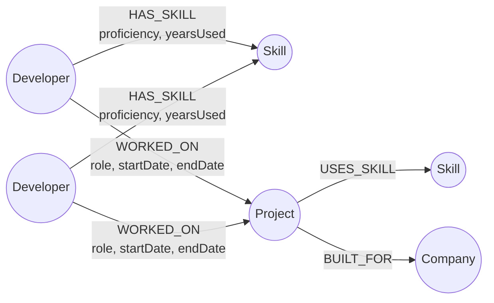
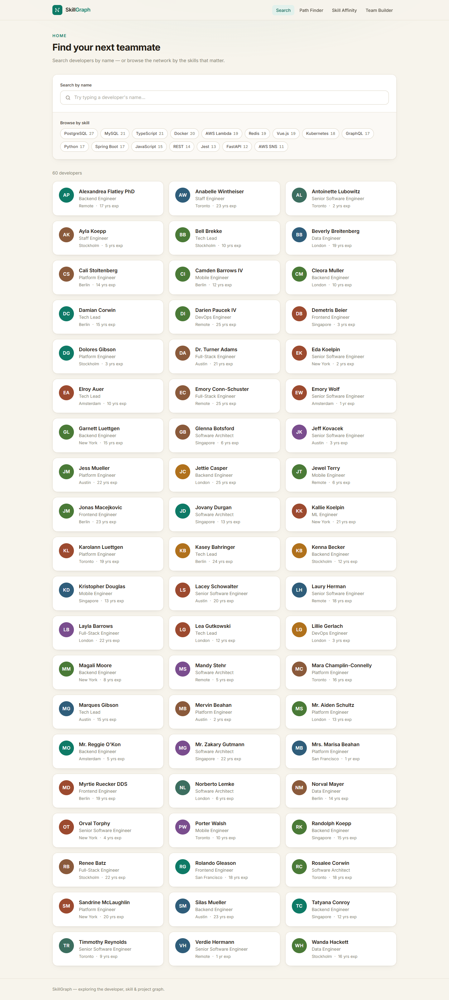
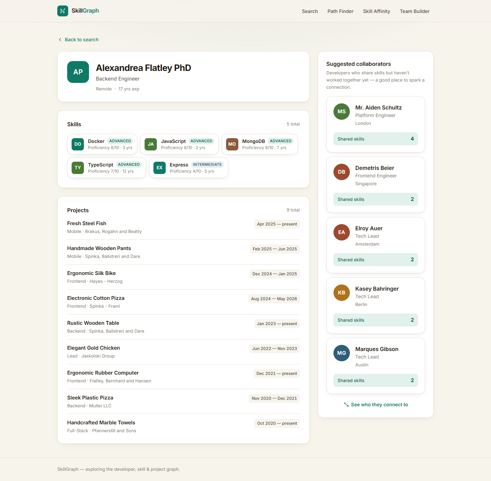
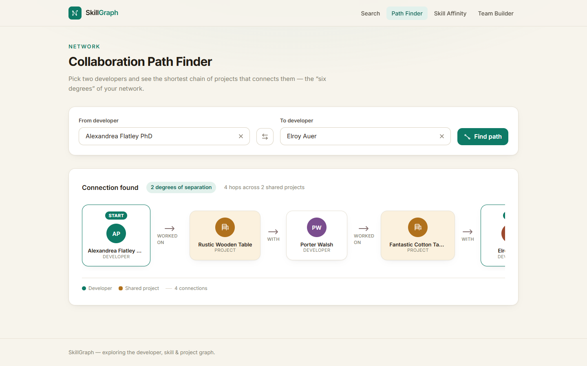
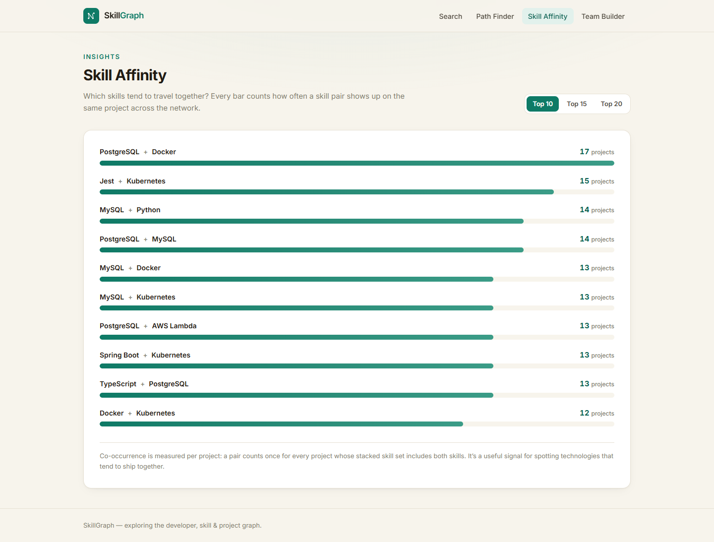
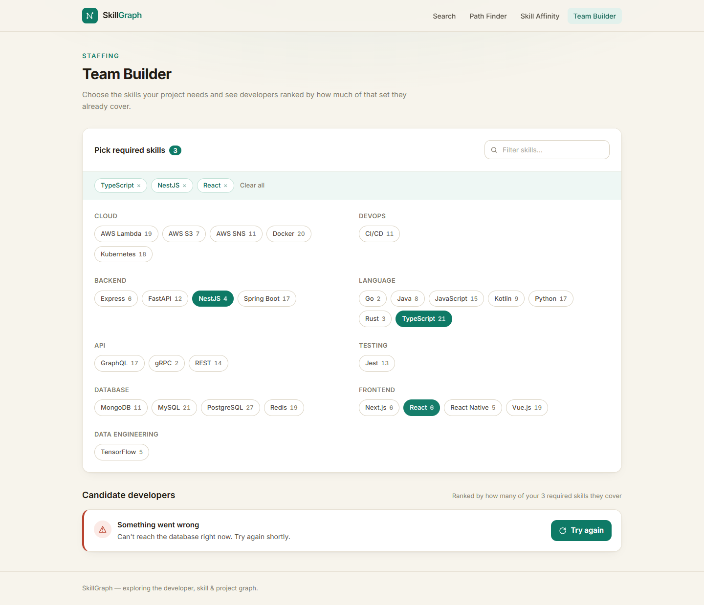
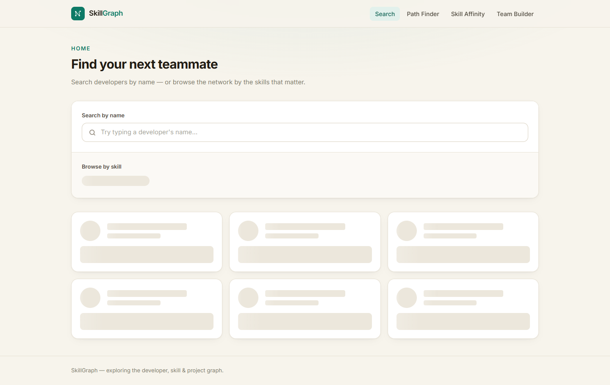
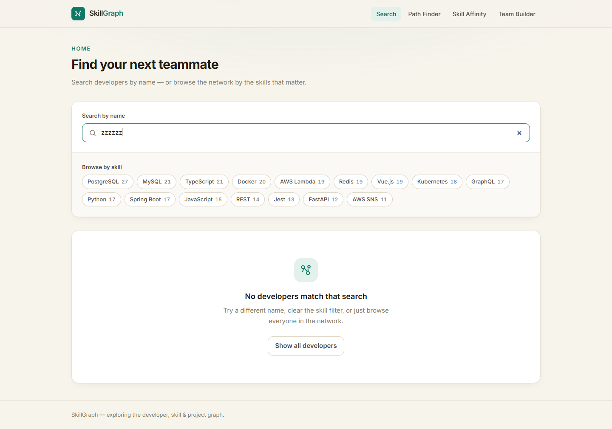
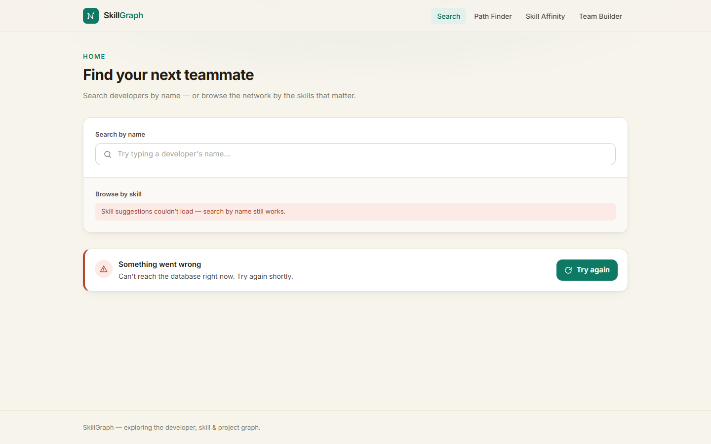

# Dev Collaboration & Skill Network

SkillGraph models a developer ecosystem — people, their skills, the projects
they've worked on and the companies those projects were built for — as one
interconnected graph. The web app lets non-technical users find teammates by
skill, discover who can collaborate, trace how any two developers are
connected through shared work, and staff a project from a coverage-ranked
shortlist. The backend is NestJS over CognoDB (Neo4j-compatible openCypher).

## Use Case

Hiring managers, team leads and recruiters need to answer questions that a list
of resumes can't: *"Who shares at least three skills with Jordan but has never
worked with them?"*, *"What's the shortest chain of shared projects connecting
Jordan to Priya?"* and *"Which skills tend to travel together?"* These are
reachability questions about a network of people and projects — exactly the
shape of a graph. SkillGraph answers them in one clean pattern match instead of
a stack of joins, and presents the answers in a friendly UI.

## Why a Graph Database?

The app's core questions are graph-shaped, not list-shaped. Two stand out:

1. **Multi-hop similarity** — `(me)-[:HAS_SKILL]->(s)<-[:HAS_SKILL]-(other)`
   reads as "everyone reachable from me through a shared skill". In SQL that is
   a self-join of a `developer_skills` join table against itself, plus another
   join to exclude people who already shared a project — an anti-join that
   grows with the network.
2. **Shortest path** — finding the `Developer → Project → Developer → …` chain
   between two people is a breadth-first search over an unbounded, bipartite
   traversal. In SQL it needs a recursive CTE with careful visited-node
   bookkeeping to avoid cycles; in Cypher it is one `shortestPath()` call and
   the engine handles the BFS, ordering and cycle detection natively.

The relational design also fights the schema: developer-to-developer
collaboration would be a derived table that goes stale the moment anyone edits
a project's team. In a graph it's computed on the fly from shared `WORKED_ON`
relationships — no duplication, no staleness.

## Data Model



**Nodes:** `Developer`, `Skill`, `Project`, `Company`

**Relationships:**

| Relationship | From → To | Properties |
| --- | --- | --- |
| `HAS_SKILL` | Developer → Skill | `proficiency` (1–10), `yearsUsed` |
| `WORKED_ON` | Developer → Project | `role`, `startDate`, `endDate` |
| `USES_SKILL` | Project → Skill | — |
| `BUILT_FOR` | Project → Company | — |

Note that `(:Developer)-[:COLLABORATED_WITH]->(:Developer)` is **intentionally
not stored** — it is derived on the fly from shared `WORKED_ON` edges (see
[Architecture Notes](#architecture-notes)).

## Setup

### 1. CognoDB Instance

1. Sign up at [console.cognodb.com](https://console.cognodb.com)
2. Create a free (c0) instance
3. Copy the `bolt+s://` URI and generated password

### 2. Environment

Copy `.env.example` to `.env` in **both** `backend/` and the repo root, and
fill in:

```ini
COGNODB_URI=bolt+s://<instance-id>.databases.cognodb.com
COGNODB_USER=cognodb
COGNODB_PASSWORD=<your-password>
PORT=3000
```

### 3. Install & seed

```bash
cd backend && npm install
npm run seed          # wipes + repopulates 60 devs / 120 projects / 18 companies
npm run start:dev     # API on http://localhost:3000
```

```bash
cd frontend && npm install
npm run dev           # UI on http://localhost:5173 (proxies /api → :3000)
```

## Main Queries

All queries are parameterised and run through `Neo4jService.runQuery(cypher,
params)` — user input is always a parameter, never interpolated into the query
string. Mirror queries also live in [`cypher/`](cypher/).

### 1. Multi-hop traversal — potential collaborators

**What it answers:** developers who share `>= minShared` skills with a given
developer but have **never** worked on a project together.

```cypher
MATCH (me:Developer {id: $devId})-[:HAS_SKILL]->(s:Skill)<-[:HAS_SKILL]-(other:Developer)
WHERE other.id <> $devId
WITH me, other, count(DISTINCT s) AS sharedSkills
WHERE sharedSkills >= $minShared
  AND NOT (me)-[:WORKED_ON]->(:Project)<-[:WORKED_ON]-(other)
RETURN other.id AS id, other.name AS name, other.title AS title, sharedSkills
ORDER BY sharedSkills DESC
LIMIT 20
```

**Why it's graph-native:** two-edge pattern matching says "reachable through a
shared skill" directly. The equivalent SQL is a self-join of the
`developer_skills` join table plus an anti-join to exclude past collaborators;
here the `NOT (...WORKED_ON...)` exclusion is a single pattern, not a join.

**Endpoint:** `GET /graph/shared-skills?devId=..&minShared=3`

### 2. Shortest collaboration path (variable-length / recursive)

**What it answers:** the shortest chain of shared projects linking two
developers — "six degrees of separation" over the bipartite
`Developer → Project → Developer` graph.

```cypher
MATCH path = shortestPath(
  (a:Developer {id: $fromId})-[:WORKED_ON*1..8]-(b:Developer {id: $toId})
)
RETURN [n IN nodes(path) | {label: head(labels(n)), id: n.id, name: n.name}] AS nodes,
       [r IN relationships(path) | {type: type(r), start: startNode(r).id, end: endNode(r).id}] AS relationships,
       length(path) AS hops
```

**Why it's graph-native:** this is a BFS over a variable-length bipartite
path — a **recursive CTE** with visited-node bookkeeping in SQL. Cypher's
`shortestPath()` does it in one call, with cycle handling built in. The depth
is capped at 8 hops to bound worst-case traversal.

**Endpoint:** `GET /graph/collaboration-path?fromId=..&toId=..`

### 3. Skill affinity — co-occurring skill pairs

**What it answers:** which pairs of skills are most often used **together on
the same project** (a "these two travel together" signal for stack decisions).

```cypher
MATCH (p:Project)-[:USES_SKILL]->(s1:Skill), (p)-[:USES_SKILL]->(s2:Skill)
WHERE id(s1) < id(s2)
RETURN s1.name AS skillA, s2.name AS skillB, count(p) AS coOccurrences
ORDER BY coOccurrences DESC, skillA, skillB
LIMIT $limit
```

**Why it's graph-native:** the `id(s1) < id(s2)` guard turns each project into
a set of unordered pairs in the pattern itself. The SQL equivalent is a
many-to-many self-join of a `project_skills` join table grouped per project —
heavier and further from the question. Walking two `USES_SKILL` edges out of
each project is index-friendly and direct.

**Endpoint:** `GET /graph/skill-affinity?limit=15`

### 4. Developer profile — skills + projects in one call

**What it answers:** a full profile in a single round trip: the developer plus
all their skills (with proficiency) and every project (with role and client
company).

```cypher
MATCH (d:Developer {id: $id})
OPTIONAL MATCH (d)-[hs:HAS_SKILL]->(s:Skill)
OPTIONAL MATCH (d)-[wo:WORKED_ON]->(p:Project)-[:BUILT_FOR]->(c:Company)
RETURN d,
       collect(DISTINCT {skill: s.name, proficiency: hs.proficiency}) AS skills,
       collect(DISTINCT {project: p.name, role: wo.role, company: c.name}) AS projects
```

**Why it's graph-native:** one traversal returns a whole subgraph with two
one-to-many branches joined via `collect(DISTINCT ...)` — cleanly avoiding the
skills×projects cartesian product a four-table SQL join would produce.

**Endpoint:** `GET /developers/:id`

### 5. Team composition suggestion (simplified set-cover)

**What it answers:** given required skills, the developers covering the most of
them, as a ranked shortlist to staff a new project.

```cypher
MATCH (d:Developer)-[:HAS_SKILL]->(s:Skill)
WHERE s.name IN $requiredSkills
RETURN d.id AS id, d.name AS name,
       collect(DISTINCT s.name) AS coveredSkills,
       count(DISTINCT s) AS coverage
ORDER BY coverage DESC, d.name
LIMIT $limit
```

**Why it's graph-native:** a fan-out pattern from developers to their skills,
filtered to the required set and ranked — the adjacency is expressed
structurally, not via joins.

**Where it stops short:** the real problem is *set cover* (find the smallest
team covering everything), which is NP-hard. This query deliberately returns
the top *individual* candidates and leaves combining them to the caller; a
production-grade version would run greedy set-cover over a bounded pool.

**Endpoint:** `GET /graph/team-suggestion?requiredSkills=GraphQL&requiredSkills=Rust&limit=10`

## Screenshots

The React UI lives in [`frontend/`](frontend/README.md) (Vite + React +
TypeScript + Tailwind v4). Loaded states of the five views:

| Home / Search | Developer Profile + collaborator suggestions |
| :--- | :--- |
|  |  |

| Path Finder | Skill Affinity | Team Builder |
| :--- | :--- | :--- |
|  |  |  |

Loading, empty and error states:

| Loading (skeleton, no flash) | Empty (helpful prompt / not-found) | Error (unreachable DB banner) |
| :--- | :--- | :--- |
|  |  |  |

Screenshots are regenerated with `frontend/scripts/screenshot.mjs`
(puppeteer-core + local Chrome) — see [`frontend/README.md`](frontend/README.md).

## Demo

- Hosted app: *— (coming soon)*
- Screen recording: *— (coming soon)*

## Architecture Notes

- **`COLLABORATED_WITH` is computed, not stored.** Developer-to-developer
  collaboration is always derived from shared `WORKED_ON` relationships at
  query time, so it can never drift out of sync with the project data — no
  redundant edges, no stale cache. This is why the "collaborator" and
  "shortest path" queries look like they hop *through* `Project` nodes.
- **Injection-safe by construction.** Every user input flows through
  parameterised Cypher (`Neo4jService.runQuery(cypher, params)`); string
  interpolation of user input is never used.
- **Error handling per layer.** Unreachable-graph errors are normalised to a
  `ServiceUnavailableException` in the backend; the frontend maps any failed
  call to a friendly banner ("Can't reach the database right now. Try again
  shortly.") with a retry action. Every view also handles loading skeletons and
  empty results explicitly — no blank screens anywhere.
- **Bounded traversals.** `shortestPath` is capped at 8 hops and shared-skill
  depth / limits are validated (`minShared 1..20`, `limit 1..50`) by
  class-validator DTOs, so a single pathological query can't hang the database.
- **Honest set-cover framing.** Team suggestion ranks individual coverage and
  explicitly does not attempt minimal-team set cover (NP-hard); the query is a
  starting pool, not an optimiser.
- **Reproducible data.** `npm run seed` is idempotent — it enforces
  constraints/indexes, wipes, then repopulates 60 developers, 18 companies and
  120 cross-project teams designed around skill clusters so the graph has
  meaningful communities.